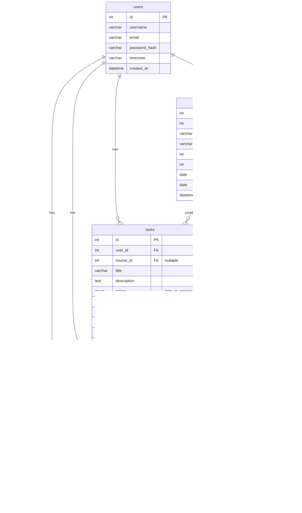

# Smart Study Planner — Implementation Plan

## 1. Project Overview

A web application that helps students create personalized study schedules, manage tasks with progress tracking, and receive dynamic in-browser reminders. Built with **plain HTML, CSS, JavaScript, and PHP** — no frameworks.

**Core Features:**
1. **Schedule Generator** — takes courses, deadlines, and priorities as input and produces a balanced weekly/daily study plan.
2. **Task Manager** — CRUD for tasks with status tracking (`todo → in-progress → done`), deadlines, and filtering.
3. **Dynamic Reminders** — JavaScript-powered countdown timers, toast notifications, and browser Notification API alerts.

---

## 2. File Structure

```
HTML_smart_planner/
│
├── index.php                    # Landing / Dashboard page
│
├── assets/
│   ├── css/
│   │   ├── variables.css        # CSS custom properties (colors, fonts, spacing)
│   │   ├── base.css             # Reset, typography, global styles
│   │   ├── layout.css           # Grid/flex utilities, responsive breakpoints
│   │   ├── components.css       # Reusable UI components (cards, buttons, modals, toasts)
│   │   ├── dashboard.css        # Dashboard-specific styles
│   │   ├── schedule.css         # Schedule generator page styles
│   │   ├── tasks.css            # Task manager page styles
│   │   └── reminders.css        # Reminders page styles
│   │
│   ├── js/
│   │   ├── app.js               # Global init, navigation, shared utilities
│   │   ├── api.js               # Fetch wrapper for all PHP API calls
│   │   ├── dashboard.js         # Dashboard widgets, summary charts
│   │   ├── schedule.js          # Schedule generation UI + algorithm invocation
│   │   ├── tasks.js             # Task CRUD, filtering, drag-and-drop status changes
│   │   ├── reminders.js         # Countdown timers, toast system, Notification API
│   │   └── charts.js            # Lightweight canvas-based chart drawing (no library)
│   │
│   └── img/
│       ├── logo.png             # App logo
│       ├── favicon.ico          # Favicon
│       └── icons/               # SVG icons for UI elements
│
├── pages/
│   ├── schedule.php             # Schedule generator page
│   ├── tasks.php                # Task management page
│   ├── reminders.php            # Reminders & countdowns page
│   ├── login.php                # Login form
│   ├── register.php             # Registration form
│   └── profile.php              # User profile / settings
│
├── includes/
│   ├── header.php               # Shared HTML head + navigation bar
│   ├── footer.php               # Shared footer + script includes
│   ├── sidebar.php              # Sidebar navigation component
│   └── auth_check.php           # Session guard — redirects if not logged in
│
├── api/
│   ├── courses.php              # CRUD endpoints for courses
│   ├── tasks.php                # CRUD endpoints for tasks
│   ├── schedule.php             # Generate / retrieve study schedule
│   ├── reminders.php            # CRUD endpoints for reminders
│   ├── auth.php                 # Login, register, logout handlers
│   └── progress.php             # Progress stats & analytics data
│
├── config/
│   ├── database.php             # PDO connection factory
│   └── app.php                  # App-wide constants (timezone, app name, etc.)
│
├── helpers/
│   ├── response.php             # JSON response helper (success/error envelopes)
│   ├── validation.php           # Input sanitization & validation functions
│   └── scheduler.php            # Core scheduling algorithm (PHP)
│
├── database/
│   └── schema.sql               # Full database schema (MySQL)
│
└── README.md                    # Project documentation
```

---

## 3. Database Schema



### SQL Highlights

```sql
-- schema.sql (key tables)

CREATE TABLE users (
    id INT AUTO_INCREMENT PRIMARY KEY,
    username VARCHAR(50) NOT NULL UNIQUE,
    email VARCHAR(100) NOT NULL UNIQUE,
    password_hash VARCHAR(255) NOT NULL,
    timezone VARCHAR(50) DEFAULT 'Africa/Addis_Ababa',
    created_at DATETIME DEFAULT CURRENT_TIMESTAMP
);

CREATE TABLE courses (
    id INT AUTO_INCREMENT PRIMARY KEY,
    user_id INT NOT NULL,
    name VARCHAR(100) NOT NULL,
    color VARCHAR(7) DEFAULT '#6366f1',
    priority TINYINT DEFAULT 2,
    weekly_hours_goal INT DEFAULT 5,
    start_date DATE,
    end_date DATE,
    created_at DATETIME DEFAULT CURRENT_TIMESTAMP,
    FOREIGN KEY (user_id) REFERENCES users(id) ON DELETE CASCADE
);

CREATE TABLE tasks (
    id INT AUTO_INCREMENT PRIMARY KEY,
    user_id INT NOT NULL,
    course_id INT,
    title VARCHAR(200) NOT NULL,
    description TEXT,
    status ENUM('todo','in_progress','done') DEFAULT 'todo',
    priority TINYINT DEFAULT 2,
    deadline DATETIME,
    estimated_minutes INT DEFAULT 60,
    actual_minutes INT DEFAULT 0,
    completed_at DATETIME,
    created_at DATETIME DEFAULT CURRENT_TIMESTAMP,
    FOREIGN KEY (user_id) REFERENCES users(id) ON DELETE CASCADE,
    FOREIGN KEY (course_id) REFERENCES courses(id) ON DELETE SET NULL
);

CREATE TABLE schedule_blocks (
    id INT AUTO_INCREMENT PRIMARY KEY,
    user_id INT NOT NULL,
    course_id INT NOT NULL,
    task_id INT,
    day_of_week TINYINT,
    start_time TIME NOT NULL,
    end_time TIME NOT NULL,
    label VARCHAR(100),
    is_recurring TINYINT DEFAULT 1,
    specific_date DATE,
    created_at DATETIME DEFAULT CURRENT_TIMESTAMP,
    FOREIGN KEY (user_id) REFERENCES users(id) ON DELETE CASCADE,
    FOREIGN KEY (course_id) REFERENCES courses(id) ON DELETE CASCADE,
    FOREIGN KEY (task_id) REFERENCES tasks(id) ON DELETE SET NULL
);

CREATE TABLE reminders (
    id INT AUTO_INCREMENT PRIMARY KEY,
    user_id INT NOT NULL,
    task_id INT,
    message VARCHAR(255) NOT NULL,
    remind_at DATETIME NOT NULL,
    is_active TINYINT DEFAULT 1,
    type ENUM('countdown','alert','notification') DEFAULT 'alert',
    created_at DATETIME DEFAULT CURRENT_TIMESTAMP,
    FOREIGN KEY (user_id) REFERENCES users(id) ON DELETE CASCADE,
    FOREIGN KEY (task_id) REFERENCES tasks(id) ON DELETE SET NULL
);
```

---

## 4. PHP API Design

All API endpoints live under `/api/` and return JSON responses with a consistent envelope:

```json
{ "success": true, "data": { ... } }
{ "success": false, "error": "Validation failed", "details": { ... } }
```

### Endpoints

| File | Method | Action | Description |
|------|--------|--------|-------------|
| `api/auth.php` | POST | `action=register` | Create account |
| `api/auth.php` | POST | `action=login` | Start session |
| `api/auth.php` | POST | `action=logout` | Destroy session |
| `api/courses.php` | GET | — | List user's courses |
| `api/courses.php` | POST | `action=create` | Add a course |
| `api/courses.php` | POST | `action=update` | Edit a course |
| `api/courses.php` | POST | `action=delete` | Remove a course |
| `api/tasks.php` | GET | `?status=&course_id=` | List/filter tasks |
| `api/tasks.php` | POST | `action=create` | Add a task |
| `api/tasks.php` | POST | `action=update` | Edit task (title, status, time) |
| `api/tasks.php` | POST | `action=delete` | Remove a task |
| `api/schedule.php` | POST | `action=generate` | Run scheduling algorithm |
| `api/schedule.php` | GET | `?week=` | Get schedule for a week |
| `api/schedule.php` | POST | `action=update_block` | Move/resize a block |
| `api/reminders.php` | GET | — | List active reminders |
| `api/reminders.php` | POST | `action=create` | Add a reminder |
| `api/reminders.php` | POST | `action=dismiss` | Deactivate a reminder |
| `api/progress.php` | GET | — | Dashboard stats (completion %, hours studied, upcoming) |

---

## 5. Scheduling Algorithm (`helpers/scheduler.php`)

The algorithm distributes study time across the week based on priority, deadlines, and user preferences.

### Input
```php
[
    'courses' => [
        ['id' => 1, 'name' => 'Math', 'priority' => 3, 'weekly_hours_goal' => 8, 'end_date' => '2026-06-15'],
        ['id' => 2, 'name' => 'History', 'priority' => 1, 'weekly_hours_goal' => 4, 'end_date' => '2026-07-01'],
    ],
    'tasks' => [ /* tasks with deadlines */ ],
    'available_slots' => [
        ['day' => 1, 'start' => '09:00', 'end' => '12:00'],
        ['day' => 1, 'start' => '14:00', 'end' => '17:00'],
        // ...
    ],
    'preferences' => [
        'max_block_minutes' => 90,
        'min_block_minutes' => 30,
        'break_minutes' => 15,
    ]
]
```

### Algorithm Steps

1. **Urgency Score** — For each course, compute:
   ```
   urgency = priority_weight × (weekly_hours_goal / days_until_deadline)
   ```
2. **Proportional Allocation** — Distribute total available hours proportionally by urgency score.
3. **Slot Filling** — Greedily assign course blocks to available time slots:
   - Respect `max_block_minutes` and `min_block_minutes`.
   - Insert breaks between consecutive blocks.
   - Alternate subjects to avoid fatigue.
4. **Task Anchoring** — If a task has a near deadline (≤3 days), anchor it to the earliest available slot for its course.
5. **Output** — Array of `schedule_blocks` ready for DB insertion.

---

## 6. JavaScript Modules — Key Responsibilities

### `api.js` — Fetch Wrapper
```js
// All API calls go through this module
const API = {
    async request(endpoint, method = 'GET', data = null) { ... },
    // Convenience methods
    courses: { list(), create(data), update(id, data), delete(id) },
    tasks:   { list(filters), create(data), update(id, data), delete(id) },
    schedule:{ generate(), getWeek(weekOffset), updateBlock(id, data) },
    reminders:{ list(), create(data), dismiss(id) },
    progress: { get() },
    auth:    { login(creds), register(creds), logout() }
};
```

### `reminders.js` — Dynamic Reminders System

| Feature | Implementation |
|---------|---------------|
| **Countdown Timers** | `setInterval` updating DOM elements every second; shows `Xd Xh Xm Xs` until deadline |
| **Toast Notifications** | CSS-animated toast stack in bottom-right; auto-dismiss after 5s |
| **Browser Notifications** | `Notification.requestPermission()` on first visit; `new Notification(...)` when a reminder fires |
| **Polling** | Every 60s, fetch active reminders from `/api/reminders.php` and compare `remind_at` with `Date.now()` |

### `schedule.js` — Schedule UI

- Renders a **weekly calendar grid** (7 columns × 24 rows).
- Course blocks are color-coded cards placed via absolute positioning.
- Users can **drag to adjust** start/end times (vanilla JS `mousedown/mousemove/mouseup`).
- "Generate Schedule" button sends courses + preferences to API and re-renders.

### `tasks.js` — Task Board

- **Kanban-style** three-column layout: `Todo | In Progress | Done`.
- Drag-and-drop between columns updates task status via API.
- Inline editing for title, deadline, and estimated time.
- Filter bar: by course, priority, and deadline range.

### `charts.js` — Lightweight Canvas Charts

- **Progress Ring** — circular progress indicator (% tasks complete).
- **Bar Chart** — hours studied per course this week.
- **Line Chart** — daily completion trend over the past 7 days.
- All drawn directly on `<canvas>` using `CanvasRenderingContext2D`.

---

## 7. Page Breakdown

### 7.1 Dashboard (`index.php`)
- Welcome banner with user's name and today's date.
- **Today's Schedule** — timeline view of today's study blocks.
- **Upcoming Deadlines** — top 5 nearest deadlines with countdowns.
- **Progress Summary** — ring chart (tasks), bar chart (hours/course).
- **Quick Actions** — buttons to add task, add course, generate schedule.

### 7.2 Schedule Generator (`pages/schedule.php`)
- **Course List Panel** — shows all courses with color badges.
- **Availability Editor** — click time slots to mark as available.
- **Preferences Form** — max block length, break duration, study start/end times.
- **Generate Button** — triggers algorithm; displays result in weekly grid.
- **Manual Adjustments** — drag/resize blocks on the grid.

### 7.3 Task Manager (`pages/tasks.php`)
- **Kanban Board** — three columns with draggable task cards.
- **Task Card** — shows title, course badge, deadline, priority flag, progress bar.
- **Add Task Modal** — form with course selector, priority, deadline picker, estimated time.
- **Filter Sidebar** — filter by course, status, priority, date range.

### 7.4 Reminders (`pages/reminders.php`)
- **Active Reminders List** — each with a live countdown timer.
- **Add Reminder Form** — link to task (optional), message, datetime picker, type selector.
- **Notification Settings** — toggle browser notifications, set default reminder offsets.
- **Toast Preview** — test button to preview toast notification styling.

### 7.5 Auth Pages (`pages/login.php`, `pages/register.php`)
- Clean, centered card forms.
- Client-side validation before submission.
- PHP-side validation with error feedback.

### 7.6 Profile (`pages/profile.php`)
- Edit username, email, timezone.
- Change password.
- Data export / account deletion.

---

## 8. Development Phases

### Phase 1 — Foundation (Days 1–3)
> [!IMPORTANT]
> This phase must be completed before any feature work begins.

| # | Task | Files |
|---|------|-------|
| 1.1 | Set up project structure (all directories and empty files) | All |
| 1.2 | Design CSS system — variables, reset, base typography, component library | `assets/css/*` |
| 1.3 | Create `database/schema.sql` and set up MySQL database | `database/schema.sql`, `config/database.php` |
| 1.4 | Build shared includes (header, footer, sidebar, auth check) | `includes/*` |
| 1.5 | Implement `helpers/response.php` and `helpers/validation.php` | `helpers/*` |
| 1.6 | Build `api.js` fetch wrapper | `assets/js/api.js` |

### Phase 2 — Authentication (Days 4–5)
| # | Task | Files |
|---|------|-------|
| 2.1 | Registration form + PHP handler | `pages/register.php`, `api/auth.php` |
| 2.2 | Login form + session management | `pages/login.php`, `api/auth.php` |
| 2.3 | Auth guard + logout | `includes/auth_check.php`, `api/auth.php` |
| 2.4 | Profile page | `pages/profile.php` |

### Phase 3 — Courses & Tasks (Days 6–10)
| # | Task | Files |
|---|------|-------|
| 3.1 | Course CRUD API | `api/courses.php` |
| 3.2 | Course management UI (add/edit/delete within dashboard or schedule page) | `assets/js/schedule.js` |
| 3.3 | Task CRUD API | `api/tasks.php` |
| 3.4 | Task manager page — Kanban board with drag-and-drop | `pages/tasks.php`, `assets/js/tasks.js` |
| 3.5 | Task filtering and inline editing | `assets/js/tasks.js` |

### Phase 4 — Schedule Generator (Days 11–15)
| # | Task | Files |
|---|------|-------|
| 4.1 | Build scheduling algorithm in PHP | `helpers/scheduler.php` |
| 4.2 | Schedule API endpoints | `api/schedule.php` |
| 4.3 | Weekly calendar grid UI | `pages/schedule.php`, `assets/js/schedule.js` |
| 4.4 | Availability editor | `assets/js/schedule.js` |
| 4.5 | Drag-to-adjust schedule blocks | `assets/js/schedule.js` |

### Phase 5 — Reminders & Notifications (Days 16–18)
| # | Task | Files |
|---|------|-------|
| 5.1 | Reminder CRUD API | `api/reminders.php` |
| 5.2 | Countdown timer engine | `assets/js/reminders.js` |
| 5.3 | Toast notification system | `assets/js/reminders.js`, `assets/css/components.css` |
| 5.4 | Browser Notification API integration | `assets/js/reminders.js` |
| 5.5 | Reminder polling + auto-fire | `assets/js/reminders.js` |

### Phase 6 — Dashboard & Analytics (Days 19–21)
| # | Task | Files |
|---|------|-------|
| 6.1 | Progress API endpoint | `api/progress.php` |
| 6.2 | Canvas chart components (ring, bar, line) | `assets/js/charts.js` |
| 6.3 | Dashboard assembly — today's schedule, deadlines, charts, quick actions | `index.php`, `assets/js/dashboard.js` |

### Phase 7 — Polish & Testing (Days 22–25)
| # | Task | Files |
|---|------|-------|
| 7.1 | Responsive design pass (mobile, tablet, desktop) | `assets/css/layout.css` |
| 7.2 | Micro-animations and transitions | `assets/css/components.css` |
| 7.3 | Error handling + edge cases | All JS and PHP |
| 7.4 | Cross-browser testing | — |
| 7.5 | README documentation | `README.md` |

---

## 9. Design Direction

> [!TIP]
> The UI should feel modern and premium — think **Linear**, **Notion**, or **Todoist**.

- **Color Palette**: Dark mode primary with accent gradients (indigo → violet → purple).
- **Typography**: Google Fonts — **Inter** for body, **Outfit** for headings.
- **Cards**: Glassmorphism with subtle `backdrop-filter: blur()` and soft borders.
- **Animations**: CSS transitions on hover (scale, shadow lift), smooth page transitions, countdown digit flip animation.
- **Icons**: Inline SVGs for consistency and crisp rendering at all sizes.
- **Layout**: Sidebar navigation (collapsible) + main content area.

---

## 10. Key Technical Decisions

| Decision | Rationale |
|----------|-----------|
| **PHP sessions for auth** | Simple, no JWT complexity; works natively with PHP |
| **PDO with prepared statements** | SQL injection prevention; database-agnostic |
| **Vanilla JS fetch for API** | No Axios/jQuery dependency; modern browser support |
| **Canvas for charts** | Avoids Chart.js dependency; full control over rendering |
| **CSS custom properties** | Theming support; easy dark/light mode toggle |
| **JSON API pattern** | Clean separation between PHP backend and JS frontend |
| **No SPA routing** | Traditional multi-page PHP app; simpler architecture |

---

## 11. Prerequisites

- **PHP 8.0+** with PDO MySQL extension enabled
- **MySQL 8.0+** or MariaDB 10.5+
- **Apache** or **Nginx** web server (or PHP built-in server for development)
- **Modern browser** (Chrome, Firefox, Edge — for Notification API, CSS backdrop-filter)
