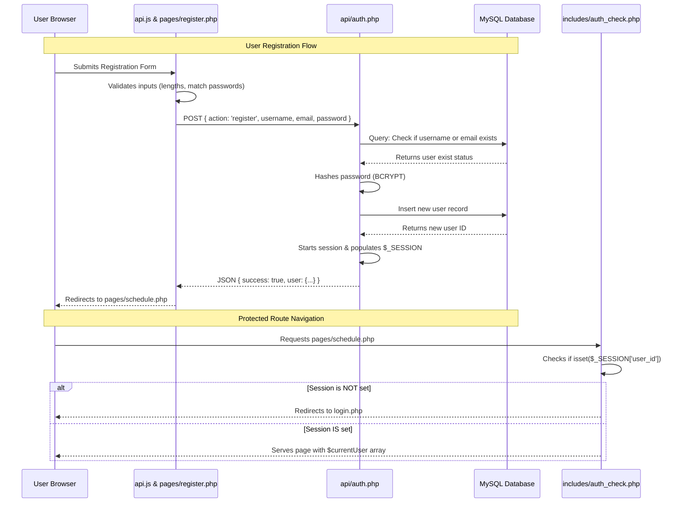

# Technical Architecture: Authentication & Schedule Generator Features

This documentation provides a deep dive into the inner workings of the **Authentication (Phase 2)** and **Schedule Generator (Phase 4)** features implemented within the Smart Study Planner. 

---

## 1. Authentication Feature Overview

The Authentication feature enables multi-user accounts, providing secure registration, login, logout, and protected route access. It utilizes native PHP session variables for state management and prepared statements for secure database transactions.

### Architectural Flow of Authentication



---

### 1.1 Database Architecture: `users` Table
The database stores user profiles in the `users` table. Passwords are never stored in plain text; instead, we store a secure hash string.

```sql
CREATE TABLE IF NOT EXISTS users (
    id INT AUTO_INCREMENT PRIMARY KEY,
    username VARCHAR(50) NOT NULL UNIQUE,
    email VARCHAR(100) NOT NULL UNIQUE,
    password_hash VARCHAR(255) NOT NULL,
    timezone VARCHAR(50) DEFAULT 'Africa/Addis_Ababa',
    created_at DATETIME DEFAULT CURRENT_TIMESTAMP
);
```

---

### 1.2 Backend API Controller (`api/auth.php`)
This file functions as the router/controller for all authentication operations. It supports four actions:
1. **`GET` Request**: Verifies if the user is logged in by checking the session.
2. **`POST (register)`**: Sanitizes input, checks for pre-existing accounts, hashes the password using `password_hash($password, PASSWORD_BCRYPT)`, creates the database record, and sets up session variables.
3. **`POST (login)`**: Fetches user credentials, performs verification using `password_verify($password, $user['password_hash'])`, and initiates the session.
4. **`POST (logout)`**: Securely destroys the session, empties the `$_SESSION` array, and clears client-side cookies.

#### Key Code Snippet: Registration & Password Hashing
```php
// Hash the password securely with BCRYPT
$hash = password_hash($password, PASSWORD_BCRYPT);
$stmt = $db->prepare('INSERT INTO users (username, email, password_hash, timezone) VALUES (?, ?, ?, ?)');
$stmt->execute([$username, $email, $hash, $timezone]);
$userId = $db->lastInsertId();

// Set session payload immediately to auto-login
$_SESSION['user_id'] = $userId;
$_SESSION['username'] = $username;
$_SESSION['email'] = $email;
$_SESSION['timezone'] = $timezone;
```

#### Key Code Snippet: Secure Session Destruction (Logout)
```php
$_SESSION = []; // Wipe variable data
if (ini_get("session.use_cookies")) {
    $params = session_get_cookie_params();
    setcookie(session_name(), '', time() - 42000,
        $params["path"], $params["domain"],
        $params["secure"], $params["httponly"]
    ); // Expire cookie from client browser
}
session_destroy(); // Destroy storage on server
jsonSuccess(['message' => 'Logged out successfully']);
```

---

### 1.3 Session Security Guard (`includes/auth_check.php`)
A lightweight middleware included at the top of pages (e.g., `schedule.php`, `profile.php`) to block unauthenticated access. It verifies the presence of `$_SESSION['user_id']` and redirects to the login screen if missing.

```php
<?php
require_once __DIR__ . '/../config/app.php';

if (!isset($_SESSION['user_id'])) {
    header('Location: login.php');
    exit;
}

$currentUser = [
    'id' => $_SESSION['user_id'],
    'username' => $_SESSION['username'],
    'email' => $_SESSION['email'],
    'timezone' => $_SESSION['timezone'] ?? 'Africa/Addis_Ababa'
];
```

---

### 1.4 Client-Side Javascript Fetch Wrapper (`assets/js/api.js`)
All frontend pages initiate network requests through the centralized asynchronous `API` utility. This prevents duplicate fetch boilerplates, standardizes header injection (`Content-Type: application/json`), and catches JSON/HTML formatting anomalies.

```javascript
auth: {
    async login(email, password) {
        return await API.request('auth.php', 'POST', { action: 'login', email, password });
    },
    async register(username, email, password) {
        return await API.request('auth.php', 'POST', { action: 'register', username, email, password });
    },
    async logout() {
        return await API.request('auth.php', 'POST', { action: 'logout' });
    },
    async checkSession() {
        return await API.request('auth.php', 'GET');
    }
}
```

---
---

## 2. Schedule Generator Feature Overview

The Schedule Generator allows users to establish daily availability patterns, insert educational courses, configure preferences (minimum/maximum block lengths, break offsets), and programmatically generate balanced weekly calendars.

### 2.1 Database Architecture: `schedule_blocks` Table
Generated scheduling blocks are saved to the persistent `schedule_blocks` table, linking each time block back to a user, a course, and optionally a specific task.

```sql
CREATE TABLE IF NOT EXISTS schedule_blocks (
    id INT AUTO_INCREMENT PRIMARY KEY,
    user_id INT NOT NULL,
    course_id INT NOT NULL,
    task_id INT,
    day_of_week TINYINT COMMENT '0=Sun..6=Sat',
    start_time TIME NOT NULL,
    end_time TIME NOT NULL,
    label VARCHAR(100),
    is_recurring TINYINT DEFAULT 1,
    specific_date DATE,
    created_at DATETIME DEFAULT CURRENT_TIMESTAMP,
    FOREIGN KEY (user_id) REFERENCES users(id) ON DELETE CASCADE,
    FOREIGN KEY (course_id) REFERENCES courses(id) ON DELETE CASCADE,
    FOREIGN KEY (task_id) REFERENCES tasks(id) ON DELETE SET NULL
);
```

---

### 2.2 Core Scheduling Algorithm (`helpers/scheduler.php`)
The scheduler uses a customized algorithm to distribute study sessions proportionally across a user's calendar based on course parameters and timezone settings.

#### Step 1: Urgency Score Calculation
Urgency is calculated for each course using a formula that weights the priority rating and the weekly time goal against the time remaining until the course's end date:
$$\text{Urgency} = \text{Priority Weight} \times \frac{\text{Weekly Goal (minutes)}}{\text{Weeks Until Deadline}}$$

```php
$endDate = new DateTime($course['end_date'] ?? '+30 days');
$daysUntil = max((int) $now->diff($endDate)->days, 1);
$weeksUntil = max($daysUntil / 7, 0.14);

$priorityWeight = ($course['priority'] ?? 2);
$weeklyGoal = ($course['weekly_hours_goal'] ?? 5) * 60; // in minutes

$urgency = $priorityWeight * ($weeklyGoal / $weeksUntil);
```

#### Step 2: Proportional Hour Allocation
Total availability is computed by counting the user's checked hours in the availability calendar. The scheduler distributes this available time proportionally among all courses according to their individual urgency scores:

```php
$totalUrgency = array_sum(array_column($coursesWithUrgency, 'urgency'));

foreach ($coursesWithUrgency as &$c) {
    $proportion = ($totalUrgency > 0) ? ($c['urgency'] / $totalUrgency) : (1 / count($coursesWithUrgency));
    $allocated = min($proportion * $totalAvailableMinutes, $c['weekly_goal']);
    $allocated = max($allocated, $minBlock); // Ensure it spans at least one minimum block
    $c['allocated'] = (int) $allocated;
    $c['remaining'] = (int) $allocated;
}
```

#### Step 3: Round-Robin Distribution & Alternation
To prevent schedule fatigue, the scheduler iterates through courses using a round-robin approach. It schedules study blocks while ensuring that it alternates between courses, avoiding consecutive hours of the same subject:

```php
while ($attempts < count($coursesWithUrgency)) {
    $idx = $tempIndex % count($coursesWithUrgency);
    if ($coursesWithUrgency[$idx]['remaining'] > 0) {
        // Try to select a course different from the last scheduled one
        if ($coursesWithUrgency[$idx]['id'] !== $lastCourseId || $attempts >= count($coursesWithUrgency) - 1) {
            $selectedCourse = &$coursesWithUrgency[$idx];
            $courseIndex = $idx + 1;
            break;
        }
    }
    $tempIndex++;
    $attempts++;
}
```

#### Step 4: Consecutive Slot Validation & Break Padding
For each block, the algorithm validates whether there is a continuous segment of unoccupied hours within the user's defined availability to fit the block. Once placed, it pads the block with break minutes:

```php
$consecutiveSlots = getConsecutiveSlots($availableSlots, $slotIndex, $slotsNeeded, $usedSlots);
// ... schedule block mapping ...
$slotIndex += count($consecutiveSlots);
if ($breakMins >= 30) {
    $slotIndex++; // Skip one hour slot to enforce break spacing
}
```

---

### 2.3 Schedule API Controller (`api/schedule.php`)
Acts as the communication bridge.
* **`generate` Action**: Translates frontend JSON request parameters into variables for the scheduler algorithm, executing the schedule generation.
* **`save` Action**: Clears out any existing database blocks matching the authenticated `user_id` and saves the updated schedule blocks.

```php
$db->beginTransaction();

// Clear existing schedule for this user
$stmt = $db->prepare('DELETE FROM schedule_blocks WHERE user_id = ?');
$stmt->execute([$userId]);

// Insert new blocks
$stmt = $db->prepare('
    INSERT INTO schedule_blocks 
    (user_id, course_id, day_of_week, start_time, end_time, label) 
    VALUES (?, ?, ?, ?, ?, ?)
');

foreach ($blocks as $block) {
    $stmt->execute([
        $userId,
        $block['course_id'],
        $block['day'],
        $block['start_time'] . ':00',
        $block['end_time'] . ':00',
        $block['label']
    ]);
}

$db->commit();
```

---

### 2.4 Interactive Frontend Calendar & Drag-to-Adjust (`assets/js/schedule.js`)
The calendar frontend generates an interactive grid view based on the schedule data. It uses custom mouse event handlers (`mousedown`, `mousemove`, `mouseup`) to let users reposition or resize study blocks directly on the calendar.

#### Drag-to-Adjust Event Flow
1. **`mousedown`**: Captures block dimensions and starts tracking coordinates. It detects whether the user clicked the bottom edge of a block (resizing) or the center of the block (dragging/repositioning).
2. **`mousemove`**: Calculates pixel movement offsets relative to the grid container and translates these offsets into hourly values.
3. **`mouseup`**: Snaps the block to the nearest grid line and updates the local Javascript state representation, readying it to be saved back to the database.

```javascript
function handleBlockMouseDown(e) {
    const blockEl = e.target.closest('.calendar-block');
    if (!blockEl) return;

    dragState.blockEl = blockEl;
    dragState.blockId = parseInt(blockEl.dataset.id);
    dragState.isResizing = e.target.classList.contains('calendar-block__resizer');
    dragState.startY = e.clientY;
    dragState.startTop = parseInt(blockEl.style.top);
    dragState.startHeight = parseInt(blockEl.style.height);

    blockEl.classList.add('dragging');
}

function handleBlockMouseMove(e) {
    if (!dragState.blockEl) return;
    e.preventDefault();

    const deltaY = e.clientY - dragState.startY;

    if (dragState.isResizing) {
        // Handle vertical resizing
        let newHeight = Math.max(30, dragState.startHeight + deltaY);
        dragState.blockEl.style.height = `${newHeight}px`;
    } else {
        // Handle vertical drag to reposition
        let newTop = Math.max(0, dragState.startTop + deltaY);
        dragState.blockEl.style.top = `${newTop}px`;
    }
}

function handleBlockMouseUp() {
    if (!dragState.blockEl) return;
    dragState.blockEl.classList.remove('dragging');

    // Calculate grid snapping based on final positions
    const finalTop = parseInt(dragState.blockEl.style.top);
    const finalHeight = parseInt(dragState.blockEl.style.height);
    
    // Snaps final positions to closest 30-minute block boundaries
    const snappedTop = Math.round(finalTop / 30) * 30;
    const snappedHeight = Math.round(finalHeight / 30) * 30;
    
    dragState.blockEl.style.top = `${snappedTop}px`;
    dragState.blockEl.style.height = `${snappedHeight}px`;

    // Save final hours back to the local javascript blocks array
    updateBlockTimesInState(dragState.blockId, snappedTop, snappedHeight);

    dragState.blockEl = null;
}
```
